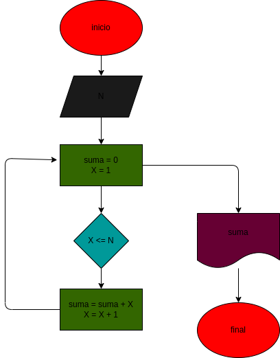

# suma_N_primeros_naturales
crear un programa para sumar los numeros naturales hasta el que definamos

# ANALISIS
## entrada
- N

## proceso
- X=1
- suma = o
- sumar el resultado de "suma" con X
- sumar X + 1

## salida
- resultado de sumar todos los numeros naturales hasta el numero N

# DISEÑO

